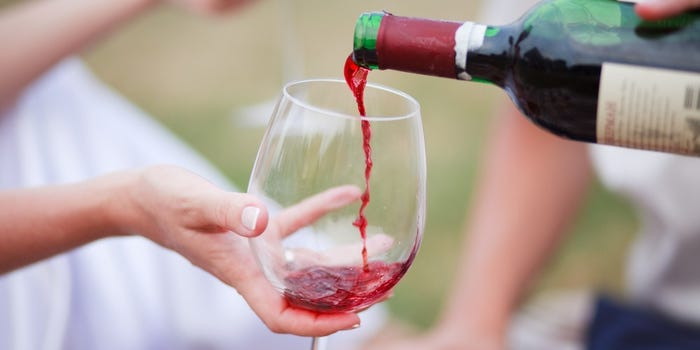

<!-- PROJECT LOGO -->
 

  

  <h1 align="center">Red Wine Quality Predictor</h1>

  
 
     
    <a href="https://redwine-quality-predictor.herokuapp.com/"><strong>Visit the website »</strong></a>
     
     
    <a href="https://redwine-quality-predictor.herokuapp.com/">View Demo</a>
  

The objective of this project is to use Machine Learning to predict the red wine quality using the wine properties such as Fixed Acidity, Volatile Acidity, Citric Sugar, Residual Sugar, Chlorides, Free Sulphur Dioxide, Total Sulphur Dioxide, Density, pH, Sulphates and Alcohol.

# Context
The two datasets are related to red and white variants of the Portuguese "Vinho Verde" wine. For more details, consult the reference [Cortez et al., 2009]. Due to privacy and logistic issues, only physicochemical (inputs) and sensory (the output) variables are available (e.g. there is no data about grape types, wine brand, wine selling price, etc.).

These datasets can be viewed as classification or regression tasks. The classes are ordered and not balanced (e.g. there are much more normal wines than excellent or poor ones).

This dataset is also available from the UCI machine learning repository, https://archive.ics.uci.edu/ml/datasets/wine+quality , I just shared it to kaggle for convenience. (If I am mistaken and the public license type disallowed me from doing so, I will take this down if requested.)

# Content
For more information, read [Cortez et al., 2009].

Input variables (based on physicochemical tests):
1 - fixed acidity
2 - volatile acidity
3 - citric acid
4 - residual sugar
5 - chlorides
6 - free sulfur dioxide
7 - total sulfur dioxide
8 - density
9 - pH
10 - sulphates
11 - alcohol
Output variable (based on sensory data):
12 - quality (score between 0 and 10)
## Acknowledgements
This dataset is also available from the UCI machine learning repository, https://archive.ics.uci.edu/ml/datasets/wine+quality , I just shared it to kaggle for convenience. (I am mistaken and the public license type disallowed me from doing so, I will take this down at first request. I am not the owner of this dataset.

Please include this citation if you plan to use this database: P. Cortez, A. Cerdeira, F. Almeida, T. Matos and J. Reis. Modeling wine preferences by data mining from physicochemical properties. In Decision Support Systems, Elsevier, 47(4):547-553, 2009.
